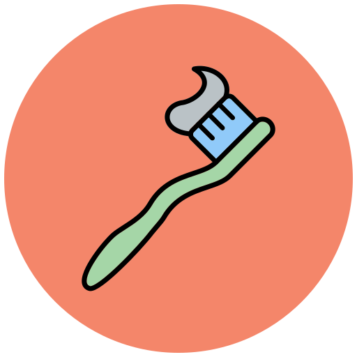
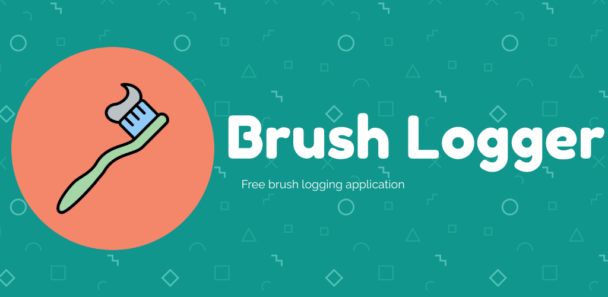

<!-- PROJECT LOGO -->
 

  

<h1 align="center"><b>Brush Logger</b></h3>

  

    Android App to Record Brushing Data
     
    <a href="https://github.com/realtofuine/brushlogger-public/wiki"><strong>Explore help »</strong></a>
     
    <a href="https://play.google.com/store/apps/details?id=com.realtofuine.brushlogger">Download App</a>
    ·
    <a href="https://github.com/realtofuine/brushlogger-public/issues">Report Bug</a>
    ·
    <a href="https://github.com/realtofuine/brushlogger-public/issues">Request Feature</a>
  

<!-- TABLE OF CONTENTS -->

  
Table of Contents

  <ol>
    <li>
      <a href="#about-the-project">About The Project</a>
    </li>
    <li>
      <a href="#getting-started">Getting Started</a>
      <ul>
        <li><a href="#prerequisites">Prerequisites</a></li>
        <li><a href="#installation">Installation</a></li>
      </ul>
    </li>
    <li><a href="#usage">Usage</a></li>
    <li><a href="#roadmap">Roadmap</a></li>
    <li><a href="#contact">Contact</a></li>
  </ol>

<!-- ABOUT THE PROJECT -->
## About The Project

Brush Logger is an Android App that allows users to either manually or automatically log their toothbrushing.

(<a href="#readme-top">back to top</a>)

<!-- GETTING STARTED -->
## Getting Started

Brush Logger can be downloaded on any Android device from the Google Play Store [here](https://play.google.com/store/apps/details?id=com.realtofuine.brushlogger).

### Prerequisites

<b>Manually:</b> Brush Logger can be used manually without any additional requirements.
<b>Automatically:</b> Automatic recording of brush data requires the use of an <u>Android-based smartwatch</u>. Apple Watches will not work!

### Installation

Download and install the app from the [Google Play Store](https://play.google.com/store/apps/details?id=com.realtofuine.brushlogger). The smartwatch app can also be downloaded from the [Google Play Store](https://play.google.com/store/apps/details?id=com.realtofuine.brushlogger).

(<a href="#readme-top">back to top</a>)

<!-- USAGE EXAMPLES -->
## Usage

App usage is explained in the [wiki](https://github.com/realtofuine/brushlogger-public/wiki), located at the top of the Github Repo or just click on the link.

(<a href="#readme-top">back to top</a>)

<!-- ROADMAP -->
## Roadmap

All upcoming and currently-worked-on features can be found on the [projects](https://github.com/users/realtofuine/projects/3) page.

(<a href="#readme-top">back to top</a>)

<!-- CONTRIBUTING -->
## Contributing

Contributing in the form of reporting bugs is highly appreciated. Please report bugs in the [issues](https://github.com/realtofuine/brushlogger-public/issues) tab.

Remember to add the label "bug" for a bug, "enhancement" for a feature request or "help wanted" if you require assistance.

<!-- CONTACT -->
## Contact

Tofuine - realtofuine@gmail.com

Website - [realtofuine.github.io](https://realtofuine.github.io)

Project Link: [https://github.com/realtofuine/brushlogger-public](https://github.com/realtofuine/brushlogger-public)

(<a href="#readme-top">back to top</a>)
